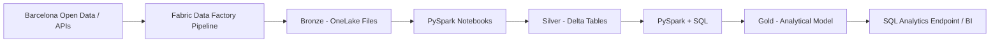
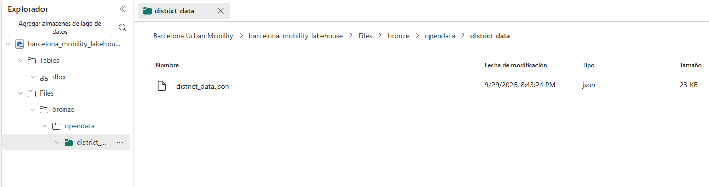

# Barcelona Urban Mobility Data Platform

I am building an end-to-end Data Engineering platform in Microsoft Fabric around Barcelona public data, with the goal of covering ingestion, orchestration, Lakehouse design, PySpark transformations, SQL modeling, data quality and analytical serving.

## Current implementation

I have completed the first working ingestion path in Fabric:

- Microsoft Fabric workspace: `Barcelona Urban Mobility`
- Lakehouse: `barcelona_mobility_lakehouse`
- Fabric Data Factory pipeline: `pl_ingest_mobility_bronze`
- Copy activity: `cp_ingest_mobility_bronze`
- Source: Barcelona Open Data CKAN REST API
- Authentication: anonymous
- Bronze storage: OneLake / Lakehouse Files
- Raw output: `Files/bronze/opendata/district_data/district_data.json`

The current source is a contextual Open Data Barcelona resource used to validate the ingestion pattern and provide district/neighborhood-level reference data. Mobility-specific sources will be added on top of the same ingestion architecture.

## Architecture



### Implemented flow

```text
Barcelona Open Data CKAN API
          |
          v
pl_ingest_mobility_bronze
          |
          v
cp_ingest_mobility_bronze
          |
          v
barcelona_mobility_lakehouse
          |
          v
Files/bronze/opendata/district_data/district_data.json
```

## Technical scope

I am using this project to implement:

- REST/API ingestion with Fabric Data Factory
- Pipeline orchestration and monitoring
- OneLake and Fabric Lakehouse storage
- Medallion architecture: Bronze, Silver and Gold
- Raw JSON preservation in Bronze
- PySpark transformations in Fabric notebooks
- Delta Lake tables for Silver and Gold
- SQL modeling and analytical queries
- Incremental loading and watermarks
- Automated data-quality checks
- Engineering decisions and operational documentation

## Repository structure

```text
.
├── architecture/
├── notebooks/
├── pipelines/
├── sql/
├── docs/
├── tests/
└── assets/
    └── images/
```

## Evidence

The repository is prepared for the Fabric screenshots that document the implementation:




## Status

**In development — Bronze ingestion operational.**

Next implementation milestone: PySpark normalization of the raw CKAN JSON into a Silver Delta table.
