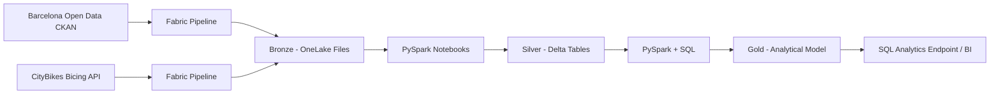

# Barcelona Urban Mobility Data Platform

I am building an end-to-end Data Engineering platform in Microsoft Fabric around Barcelona public data, covering ingestion, orchestration, Lakehouse design, PySpark transformations, Delta Lake, data quality, SQL modeling and analytical serving.

## Current implementation

Two Bronze ingestion paths are operational and the first source has already been transformed into Silver.

### Contextual district data

- Source: Barcelona Open Data CKAN REST API
- Pipeline: `pl_ingest_mobility_bronze`
- Copy activity: `cp_ingest_mobility_bronze`
- Bronze file: `Files/bronze/opendata/district_data/district_data.json`
- PySpark notebook: `nb_bronze_to_silver_districts`
- Silver Delta table: `silver_district_context`
- Silver quality assertions: operational

### Bicing station availability

- Source: CityBikes REST API
- Network: `bicing`
- Pipeline: `pl_ingest_bicing_bronze`
- Copy activity: `cp_ingest_bicing_bronze`
- Bronze file: `Files/bronze/citybikes/bicing/bicing_snapshot.json`
- Silver transformation: next implementation step

The district dataset provides geographic and contextual attributes. The Bicing source introduces operational mobility data with station-level availability, coordinates and source timestamps.

## Architecture



## Implemented flows

```text
Barcelona Open Data CKAN API
        ↓
pl_ingest_mobility_bronze
        ↓
Files/bronze/opendata/district_data/district_data.json
        ↓
nb_bronze_to_silver_districts
        ↓
silver_district_context
```

```text
CityBikes Bicing API
        ↓
pl_ingest_bicing_bronze
        ↓
Files/bronze/citybikes/bicing/bicing_snapshot.json
        ↓
nb_bronze_to_silver_bicing
        ↓
silver_bicing_station_status
        (next)
```

## Bronze milestone

The Bronze layer now contains two independent REST ingestion paths. I preserve source payloads before applying curated transformations so they remain available for replay, auditing and troubleshooting.

## Silver milestone

The first Bronze-to-Silver transformation is operational for the contextual district source. The notebook:

- reads the multiline raw JSON
- extracts and explodes `result.records`
- flattens the nested payload
- normalizes column names
- casts identifiers and analytical values explicitly
- removes exact duplicates
- adds `silver_processed_at`
- validates row preservation, uniqueness, critical nulls and invalid negative values
- persists the curated result as a Delta table

The validated run preserved all 100 source records and passed all implemented Silver assertions.

The next Silver implementation will normalize Bicing station observations from `network.stations`.

## Technical scope

The project covers:

- REST/API ingestion with Fabric Data Factory
- multiple independent ingestion sources
- pipeline orchestration and monitoring
- OneLake and Fabric Lakehouse storage
- Medallion architecture: Bronze, Silver and Gold
- raw JSON preservation in Bronze
- nested JSON normalization with PySpark
- Delta Lake tables for curated layers
- automated data-quality assertions
- SQL modeling and analytical queries
- incremental loading and historical snapshots
- engineering decisions and operational documentation

## Repository structure

```text
.
├── architecture/
├── notebooks/
├── pipelines/
├── sql/
├── docs/
├── tests/
└── assets/
    └── images/
```

## Evidence

Implementation screenshots are stored under `assets/images/`.

Current Bronze evidence:

- `01-fabric-lakehouse.png`
- `02-rest-source-preview.png`
- `03-bronze-pipeline-run.png`
- `04-bronze-file.png`

Additional Bicing and Silver evidence will be added as the corresponding implementation views are captured.

## Status

**In development — contextual Bronze-to-Silver is operational and Bicing Bronze ingestion is operational.**

Next milestone: transform the Bicing station snapshot into `silver_bicing_station_status`, add source-specific quality checks and prepare the snapshot history for incremental processing.
