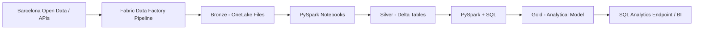

# Barcelona Urban Mobility Data Platform

I am building an end-to-end Data Engineering platform in Microsoft Fabric around Barcelona public data, with the goal of covering ingestion, orchestration, Lakehouse design, PySpark transformations, SQL modeling, data quality and analytical serving.

## Current implementation

The first end-to-end path from source to Silver is operational:

- Microsoft Fabric workspace: `Barcelona Urban Mobility`
- Lakehouse: `barcelona_mobility_lakehouse`
- Fabric Data Factory pipeline: `pl_ingest_mobility_bronze`
- Copy activity: `cp_ingest_mobility_bronze`
- Source: Barcelona Open Data CKAN REST API
- Authentication: anonymous
- Bronze storage: OneLake / Lakehouse Files
- Raw output: `Files/bronze/opendata/district_data/district_data.json`
- PySpark notebook: `nb_bronze_to_silver_districts`
- Silver Delta table: `silver_district_context`

The current source is a contextual Open Data Barcelona resource used to validate the ingestion and transformation pattern and to provide district/neighborhood-level reference data. Mobility-specific sources will be added on top of the same architecture.

## Architecture



### Implemented flow

```text
Barcelona Open Data CKAN API
          |
          v
pl_ingest_mobility_bronze
          |
          v
cp_ingest_mobility_bronze
          |
          v
Files/bronze/opendata/district_data/district_data.json
          |
          v
nb_bronze_to_silver_districts
          |
          v
silver_district_context
```

## Bronze milestone

The Bronze pipeline is working end to end. Fabric retrieves the CKAN JSON response and stores the raw payload without flattening or business transformations.

## Silver milestone

The first Bronze-to-Silver transformation is implemented in PySpark. The notebook:

- reads the multiline raw JSON
- extracts and explodes `result.records`
- flattens the nested payload
- normalizes column names
- casts identifiers and analytical values explicitly
- removes exact duplicates
- adds `silver_processed_at`
- validates row preservation, uniqueness, critical nulls and invalid negative values
- persists the curated result as a Delta table

The current run preserved all 100 source records and all automated Silver checks passed.

## Technical scope

This project covers:

- REST/API ingestion with Fabric Data Factory
- Pipeline orchestration and monitoring
- OneLake and Fabric Lakehouse storage
- Medallion architecture: Bronze, Silver and Gold
- Raw JSON preservation in Bronze
- PySpark transformations in Fabric notebooks
- Delta Lake tables for curated layers
- Automated data-quality assertions
- SQL modeling and analytical queries
- Incremental loading and watermarks
- Engineering decisions and operational documentation

## Repository structure

```text
.
├── architecture/
├── notebooks/
├── pipelines/
├── sql/
├── docs/
├── tests/
└── assets/
    └── images/
```

## Evidence

Implementation screenshots are stored under `assets/images/`. Bronze screenshots use the following filenames:

- `01-fabric-lakehouse.png`
- `02-rest-source-preview.png`
- `03-bronze-pipeline-run.png`
- `04-bronze-file.png`

Silver evidence will be added after the remaining implementation screenshots are captured.

## Status

**In development — Bronze ingestion and the first Silver Delta transformation are operational.**

Next milestone: add a mobility-specific source and transform it through Bronze and Silver before defining the first Gold analytical model.
