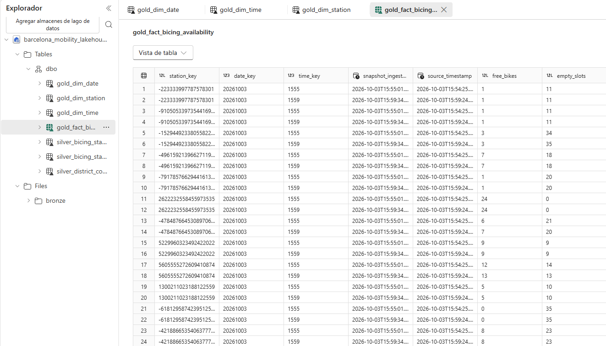
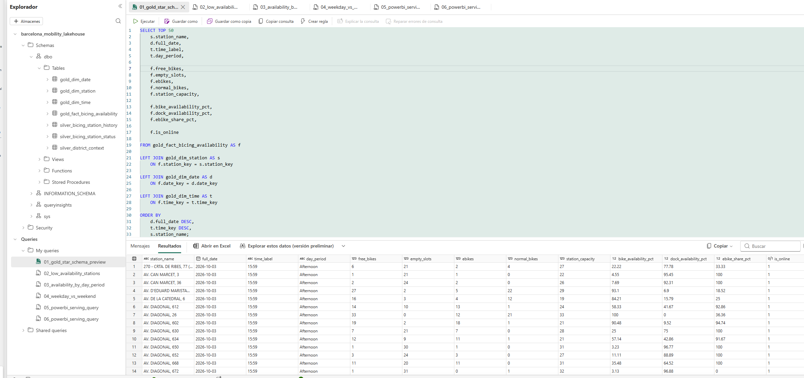
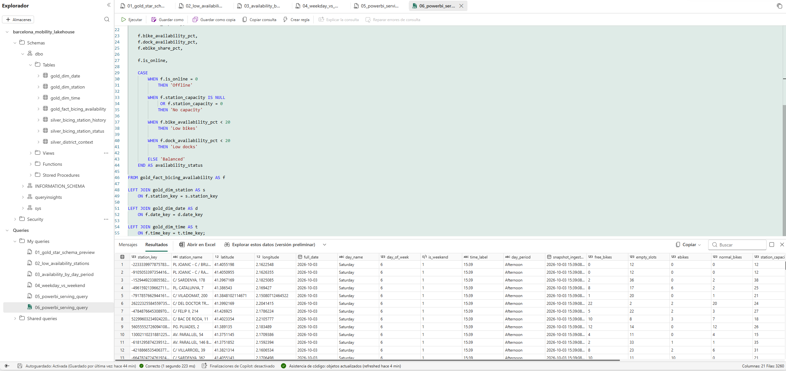

# Barcelona Urban Mobility Data Platform

I am building an end-to-end Data Engineering platform in Microsoft Fabric around Barcelona public data.

The project currently implements REST ingestion, historical Bronze snapshots, incremental Silver processing, a Gold star schema and SQL analytical serving for Bicing availability data.

## Architecture

```text
Barcelona Open Data ─┐
                     ├─> Fabric Data Factory
CityBikes Bicing API ┘
                            │
                            ▼
                    Bronze / OneLake
                            │
                            ▼
                    PySpark / Delta
                            │
                            ▼
                         Silver
                            │
                            ▼
                    Gold Star Schema
                            │
                            ▼
                 SQL Analytics Endpoint
                            │
                            ▼
                        Power BI
```

See [Architecture](architecture/README.md) for the detailed flow.

## Implemented data paths

### Contextual district data

- Pipeline: `pl_ingest_mobility_bronze`
- Bronze: `Files/bronze/opendata/district_data/district_data.json`
- Notebook: `nb_bronze_to_silver_districts`
- Silver: `silver_district_context`

### Bicing mobility data

- Source: CityBikes Bicing REST API
- Pipeline: `pl_ingest_bicing_bronze`
- Bronze history: immutable timestamped JSON snapshots partitioned by year/month/day
- Historical notebook: `nb_bicing_snapshot_history`
- Historical Silver: `silver_bicing_station_history`
- Incremental strategy: watermark + Delta MERGE
- Orchestration: Copy activity → Notebook activity

Historical grain:

```text
station_id + snapshot_ingested_at
```

The historical notebook supports bootstrap and incremental execution, reads only snapshots newer than the current watermark, exits successfully when there is no new data and does not duplicate rows when the same batch is reprocessed.

## Gold analytical layer

Notebook:

```text
nb_gold_bicing_analytics
```

Gold is modeled as a star schema:

```text
                    gold_dim_station
                           │
                           │ station_key
                           ▼
gold_dim_date ──> gold_fact_bicing_availability <── gold_dim_time
```

Persisted Delta tables:

- `gold_dim_station`
- `gold_dim_date`
- `gold_dim_time`
- `gold_fact_bicing_availability`

The fact table keeps one station observation per ingestion snapshot and exposes analytical measures including:

- available bikes and empty docks
- e-bike and normal-bike counts
- station capacity
- `bike_availability_pct`
- `dock_availability_pct`
- `ebike_share_pct`

The Gold notebook rebuilds the analytical layer from the validated Silver history using Delta overwrite. Silver remains the historical source of truth.

See [Data Model](docs/data-model.md), [Data Quality](docs/data-quality.md) and [Engineering Decisions](docs/decisions.md).

## SQL Analytics Endpoint

The Gold Delta tables are exposed through the Fabric SQL Analytics Endpoint and queried with T-SQL.

Repository queries:

- `01_gold_star_schema_preview.sql` — joins fact + station/date/time dimensions
- `02_low_availability_stations.sql` — ranks online stations by average bike availability
- `03_availability_by_day_period.sql` — aggregates KPIs by day period
- `04_weekday_vs_weekend.sql` — compares weekday/weekend availability
- `05_availability_by_day.sql` — aggregates availability by day of week
- `06_powerbi_serving_query.sql` — denormalized serving query for downstream BI

The serving query combines station, date and time context with Gold measures and derives an `availability_status` using `CASE`:

```text
Offline
No capacity
Low bikes
Low docks
Balanced
```

See [SQL queries](sql/README.md).

## Data quality

Silver and Gold both include explicit validation.

Gold checks include:

- Silver-to-fact row reconciliation
- unique fact grain
- unique station surrogate keys
- non-null foreign keys
- referential integrity against station, date and time dimensions
- KPI percentage ranges

Source inconsistencies that are not critical are preserved rather than silently corrected.

## Evidence

### Historical and incremental processing

- `13-bicing-bronze-history.png`
- `14-bicing-incremental-merge.png`
- `15-bicing-end-to-end-pipeline.png`

### Gold analytical layer

- `16-gold-star-schema-tables.png`
- `17-gold-quality-checks.png`
- `18-gold-analytical-validation.png`

### SQL analytical serving

- `19-sql-analytics-endpoint.png`
- `20-sql-serving-query.png`







## Current status

**Bronze, historical/incremental Silver, Gold star-schema modeling and SQL analytical serving are operational.**

Next milestones:

1. Build the Power BI analytical/reporting layer.
2. Optionally attach Gold processing to the end-to-end Fabric orchestration.
3. Complete the final architecture diagrams and portfolio documentation.
