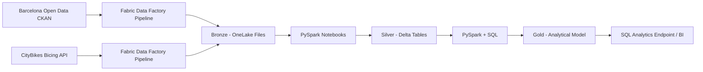

# Barcelona Urban Mobility Data Platform

I am building an end-to-end Data Engineering platform in Microsoft Fabric around Barcelona public data, covering ingestion, orchestration, Lakehouse design, PySpark transformations, Delta Lake, data quality, SQL modeling and analytical serving.

## Current implementation

Two independent REST ingestion paths are operational and both now reach Silver.

### Contextual district data

- Source: Barcelona Open Data CKAN REST API
- Pipeline: `pl_ingest_mobility_bronze`
- Copy activity: `cp_ingest_mobility_bronze`
- Bronze file: `Files/bronze/opendata/district_data/district_data.json`
- PySpark notebook: `nb_bronze_to_silver_districts`
- Silver Delta table: `silver_district_context`
- Silver quality assertions: operational

### Bicing station availability

- Source: CityBikes REST API
- Network: `bicing`
- Pipeline: `pl_ingest_bicing_bronze`
- Copy activity: `cp_ingest_bicing_bronze`
- Bronze file: `Files/bronze/citybikes/bicing/bicing_snapshot.json`
- PySpark notebook: `nb_bronze_to_silver_bicing`
- Silver Delta table: `silver_bicing_station_status`
- Current validated row count: 544
- Critical Silver quality assertions: passed
- Non-critical source inconsistency tracking: implemented

The district dataset provides contextual geographic attributes. The Bicing source provides station-level availability, coordinates, bike-type breakdowns and source timestamps.

## Architecture



## Implemented flows

```text
Barcelona Open Data CKAN API
        ↓
pl_ingest_mobility_bronze
        ↓
Files/bronze/opendata/district_data/district_data.json
        ↓
nb_bronze_to_silver_districts
        ↓
silver_district_context
```

```text
CityBikes Bicing API
        ↓
pl_ingest_bicing_bronze
        ↓
Files/bronze/citybikes/bicing/bicing_snapshot.json
        ↓
nb_bronze_to_silver_bicing
        ↓
silver_bicing_station_status
```

## Silver milestone

The Bicing transformation now:

- extracts and explodes `network.stations`
- normalizes station-level fields
- parses source timestamps explicitly
- casts identifiers and measures
- derives station capacity
- removes duplicate station snapshots
- validates critical nulls, coordinates and availability values
- classifies bike-breakdown inconsistencies as non-critical warnings
- adds `bike_breakdown_valid` for traceability
- persists the curated result as a Delta table

The validated Bicing Silver table contains 544 station observations.

## Data quality and troubleshooting

Implementation issues that affected parsing or data-quality behavior are documented separately so technical decisions remain traceable.

See [Troubleshooting](docs/troubleshooting.md).

The two documented cases are:

- CityBikes timestamp parsing failure caused by a non-standard timezone suffix combination.
- A bike-type availability inconsistency in one offline station record, handled as a warning rather than a destructive correction.

## Technical scope

The project currently covers:

- REST/API ingestion with Fabric Data Factory
- multiple independent ingestion sources
- pipeline orchestration and monitoring
- OneLake and Fabric Lakehouse storage
- Medallion architecture
- raw JSON preservation in Bronze
- nested JSON normalization with PySpark
- explicit timestamp parsing
- Delta Lake tables for curated layers
- critical assertions and non-critical quality flags
- source anomaly investigation
- SQL modeling and analytical queries
- incremental loading and historical snapshots
- engineering decisions and operational documentation

## Repository structure

```text
.
├── architecture/
├── notebooks/
├── pipelines/
├── sql/
├── docs/
│   └── troubleshooting.md
├── tests/
└── assets/
    └── images/
```

## Evidence

Implementation evidence is stored under `assets/images/`.

Current evidence covers:

- contextual Bronze ingestion
- contextual Silver table and quality checks
- Bicing REST source preview
- Bicing Bronze pipeline execution
- Bicing Bronze file persistence

The next three screenshots are reserved for the completed Bicing Silver milestone and troubleshooting cases:

- `10-bicing-timestamp-parsing.png`
- `11-bicing-offline-quality-anomaly.png`
- `12-bicing-silver-table.png`

## Status

**In development — both current sources reach Silver successfully.**

Next milestone: preserve historical Bicing snapshots, add incremental processing and prepare the first Gold analytical model.
