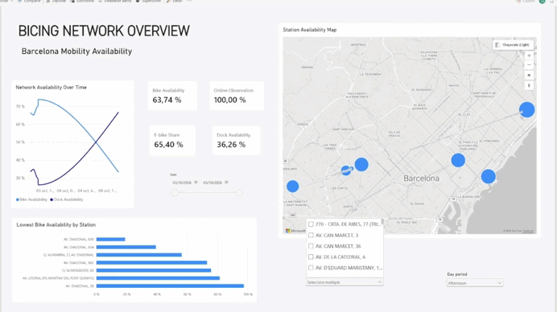
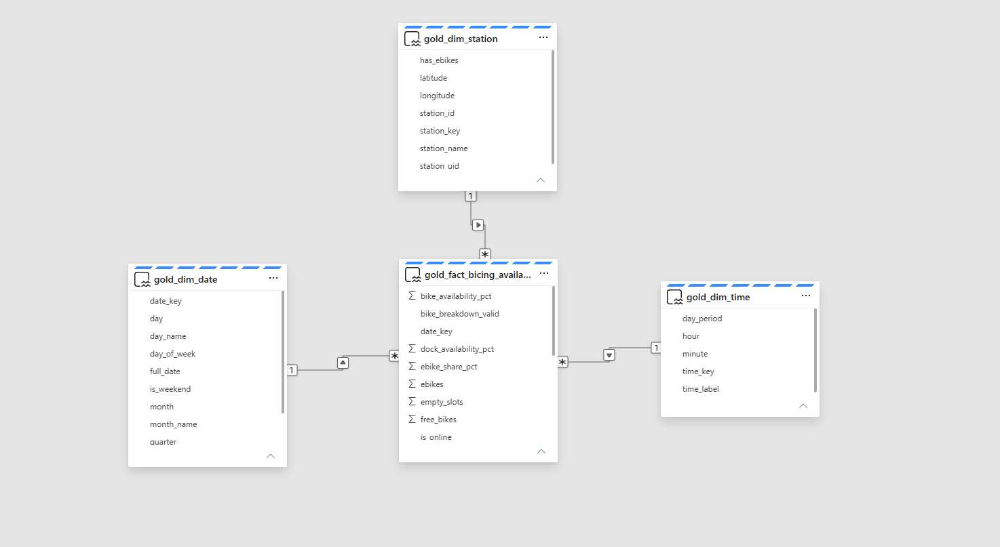
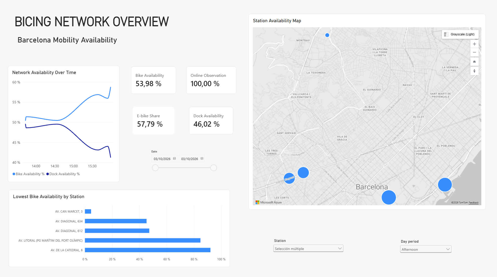

# Barcelona Urban Mobility Data Platform

I built an end-to-end Data Engineering platform in Microsoft Fabric around Barcelona public mobility data.

The project covers REST ingestion, immutable Bronze history, incremental Silver processing, Delta MERGE, Gold dimensional modeling, SQL analytics and a Power BI semantic/reporting layer.

## Demo



The GIF is a permanent portfolio demo of the interactive report. The repository also includes the Power BI report artifact and static evidence screenshots.

## Architecture

```text
Barcelona Open Data ─┐
                     ├─> Fabric Data Factory
CityBikes Bicing API ┘
                            │
                            ▼
                    Bronze / OneLake
                            │
                            ▼
                    PySpark / Delta
                            │
                            ▼
                 Silver historical layer
                            │
                            ▼
                    Gold Star Schema
                            │
              ┌─────────────┴─────────────┐
              ▼                           ▼
      SQL Analytics Endpoint      Power BI Semantic Model
                                          │
                                          ▼
                                     Dashboard
```

See [Architecture](architecture/README.md) for the detailed flow.

## End-to-end Bicing pipeline

The production flow is orchestrated in Fabric:

```text
CityBikes REST API
        │
        ▼
cp_ingest_bicing_bronze
        │ Success
        ▼
Historical Silver notebook
        │ Success
        ▼
nb_gold_bicing_analytics
        │
        ▼
Gold Delta star schema
        │
        ├── SQL Analytics Endpoint
        └── Power BI
```

The final orchestration has been executed successfully from Bronze ingestion through Gold generation.

## Bronze and incremental Silver

Bicing history is stored as immutable timestamped JSON snapshots:

```text
Files/bronze/citybikes/bicing/history/
└── year=YYYY/month=MM/day=DD/
    └── bicing_YYYYMMDD_HHMMSS.json
```

Historical Silver table:

```text
silver_bicing_station_history
```

Historical grain:

```text
station_id + snapshot_ingested_at
```

The incremental notebook:

- derives a watermark from the historical Silver table
- reads only newer Bronze snapshots
- validates each incremental batch
- exits successfully when there is no new data
- performs an idempotent Delta MERGE
- preserves source warnings instead of silently correcting them

## Gold analytical layer

Gold is modeled as a star schema:

```text
                    gold_dim_station
                           │
                           │ station_key
                           ▼
gold_dim_date ──> gold_fact_bicing_availability <── gold_dim_time
```

Persisted Delta tables:

- `gold_dim_station`
- `gold_dim_date`
- `gold_dim_time`
- `gold_fact_bicing_availability`

The fact table keeps one station observation per ingestion snapshot and exposes:

- available bikes and empty docks
- e-bike and normal-bike counts
- station capacity
- `bike_availability_pct`
- `dock_availability_pct`
- `ebike_share_pct`

Gold is currently rebuilt from the validated Silver history using Delta overwrite. Silver remains the historical source of truth.

See [Data Model](docs/data-model.md), [Data Quality](docs/data-quality.md) and [Engineering Decisions](docs/decisions.md).

## SQL Analytics Endpoint

The Gold Delta tables are exposed through Fabric's SQL Analytics Endpoint.

Versioned T-SQL queries under `sql/` cover:

- star-schema preview
- low-availability station ranking
- availability by day period
- weekday vs weekend comparison
- day-of-week analysis
- a denormalized Power BI serving query

The SQL serving query also derives:

```text
Offline
No capacity
Low bikes
Low docks
Balanced
```

See [SQL queries](sql/README.md).

## Power BI

The semantic model uses the Gold star schema directly.

Relationships:

```text
gold_dim_station[station_key]  1 ─── * gold_fact_bicing_availability[station_key]
gold_dim_date[date_key]        1 ─── * gold_fact_bicing_availability[date_key]
gold_dim_time[time_key]        1 ─── * gold_fact_bicing_availability[time_key]
```

Filters flow from dimensions to the fact.

The report includes:

- weighted bike availability KPI
- weighted dock availability KPI
- e-bike share
- online observation rate
- date, day-period and station slicers
- station availability map
- availability-over-time line chart
- low-availability station ranking

The repository includes a live-connected Power BI report artifact:

[Power BI report](assets/powerbi/Bicing%20Network%20Overview.pbix)

Because it is live-connected to the Fabric semantic model, the PBIX itself does not embed the underlying Direct Lake data. The GIF and screenshots remain self-contained portfolio evidence.

See [Power BI notes](assets/powerbi/README.md).

## Data quality

Silver and Gold both include explicit validation.

Gold checks include:

- Silver-to-fact row reconciliation
- unique fact grain
- unique station surrogate keys
- non-null foreign keys
- referential integrity against station, date and time dimensions
- KPI percentage ranges

Source inconsistencies that are not critical are preserved rather than silently corrected.

## Evidence

### Historical and incremental processing

- `13-bicing-bronze-history.png`
- `14-bicing-incremental-merge.png`
- `15-bicing-end-to-end-pipeline.png`

### Gold analytical layer

- `16-gold-star-schema-tables.png`
- `17-gold-quality-checks.png`
- `18-gold-analytical-validation.png`

### SQL analytical serving

- `19-sql-analytics-endpoint.png`
- `20-sql-serving-query.png`

### Power BI and final orchestration

- `21-powerbi-semantic-model.png`
- `22-end-to-end-bronze-silver-gold.png`
- `23-powerbi-network-overview.png`
- `assets/demos/project-barcelona.gif`





## Current status

**Core technical implementation is complete: Bronze → incremental Silver → Gold → SQL → Power BI.**

The remaining work is portfolio presentation: final architecture diagrams and documentation polish.
