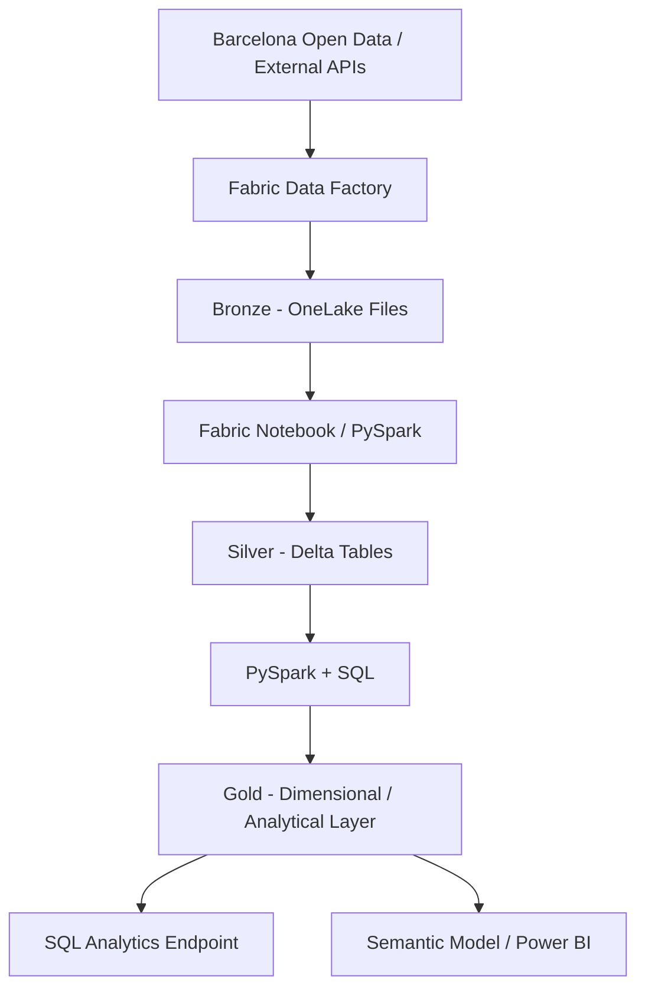

# Architecture

I am using a Medallion architecture in Microsoft Fabric so raw ingestion, standardized data and analytical data remain separated.



## Bronze

I preserve source responses with minimal modification so the original payload remains available for replay, auditing and troubleshooting.

Current object:

```text
Files/bronze/opendata/district_data/district_data.json
```

## Silver

The first Silver transformation is implemented in `nb_bronze_to_silver_districts`.

The notebook reads the raw CKAN envelope, extracts `result.records`, flattens the nested records, standardizes the schema, performs quality checks and writes:

```text
silver_district_context
```

as a Delta table in the Fabric Lakehouse.

The table is intentionally named `silver_district_context` because the source grain includes census section, neighborhood, district and nationality attributes rather than one row per district.

## Gold

I will build the Gold layer once mobility-specific sources are incorporated and their analytical grain is clear. Gold will expose business-ready mobility entities, dimensions, facts and KPIs for SQL and BI consumption.

## Current Fabric components

| Component | Name | Status |
|---|---|---|
| Workspace | Barcelona Urban Mobility | Implemented |
| Lakehouse | barcelona_mobility_lakehouse | Implemented |
| Bronze pipeline | pl_ingest_mobility_bronze | Implemented |
| Copy activity | cp_ingest_mobility_bronze | Implemented |
| Bronze raw JSON | district_data.json | Implemented |
| Silver notebook | nb_bronze_to_silver_districts | Implemented |
| Silver Delta table | silver_district_context | Implemented |
| Silver quality assertions | Notebook assertions | Implemented |
| Mobility-specific source | Pending | Next |
| Gold model | Pending | Planned |

## Architecture image

A polished end-to-end architecture diagram will be added as `assets/images/architecture-overview.png` when the target architecture is complete.
