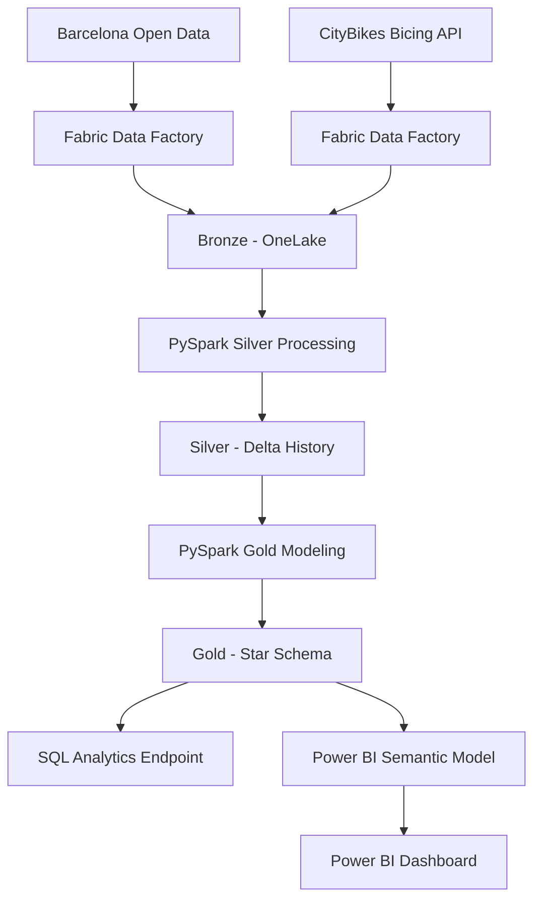
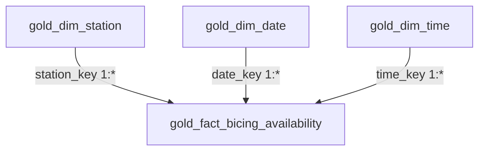

# Architecture

I use a Medallion architecture in Microsoft Fabric.



## Bronze

Context source:

```text
Files/bronze/opendata/district_data/district_data.json
```

Bicing history:

```text
Files/bronze/citybikes/bicing/history/year=YYYY/month=MM/day=DD/bicing_YYYYMMDD_HHMMSS.json
```

Timestamped snapshots prevent overwrite and preserve historical observations for replay and incremental processing.

## Silver

Operational tables:

- `silver_district_context`
- `silver_bicing_station_status` — initial single-snapshot milestone
- `silver_bicing_station_history` — historical incremental table

Historical grain:

```text
station_id + snapshot_ingested_at
```

The historical Bicing table is maintained with watermark-based incremental processing and an idempotent Delta MERGE.

## End-to-end orchestration

The Bicing pipeline now runs the full engineering path in sequence:

```text
cp_ingest_bicing_bronze
        │ Success
        ▼
Historical Silver notebook
        │ Success
        ▼
nb_gold_bicing_analytics
```

This guarantees that Gold is rebuilt only after the Bronze ingestion and Silver historical processing complete successfully.

The final Bronze → Silver → Gold run has been validated successfully.

## Gold

Gold is implemented as a star schema.



### Fact grain

```text
one Bicing station observation per ingestion snapshot
```

Logical historical key:

```text
station_key + snapshot_ingested_at
```

Gold uses a deterministic `xxhash64(station_id)` surrogate key for station relationships.

## Rebuild strategy

Silver is the historical source of truth and is incrementally maintained.

Gold is rebuilt from the complete validated Silver history:

```text
Silver history
      │
      ▼
dimensions + fact
      │
      ▼
quality checks
      │
      ▼
Delta overwrite
```

For the current volume, a full Gold rebuild keeps KPI logic and dimensions deterministic and simple.

## SQL serving layer

Fabric exposes the Gold Delta tables through the SQL Analytics Endpoint.

The SQL layer provides joins, aggregations and a BI-oriented serving projection while keeping the physical Gold model dimensional.

## Power BI semantic layer

Power BI consumes the Gold star schema directly.

Relationships are one-to-many with single-direction filtering from dimensions to fact:

```text
dim_station 1 ─── * fact
dim_date    1 ─── * fact
dim_time    1 ─── * fact
```

DAX measures aggregate the fact dynamically under report filter context.

The final report uses station, date and time dimensions to filter KPI cards, an Azure Maps station view, the historical availability line chart and the station ranking.

## Context dataset boundary

`silver_district_context` is not joined into the Bicing star schema because the current datasets do not expose a reliable direct key or equivalent spatial geometry.

No name-based or artificial join is used. A future spatial enrichment can assign stations to districts or neighborhoods when appropriate geographic boundaries are available.
