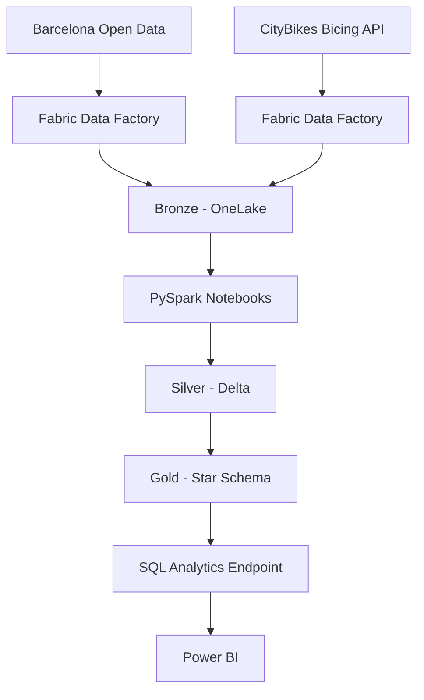
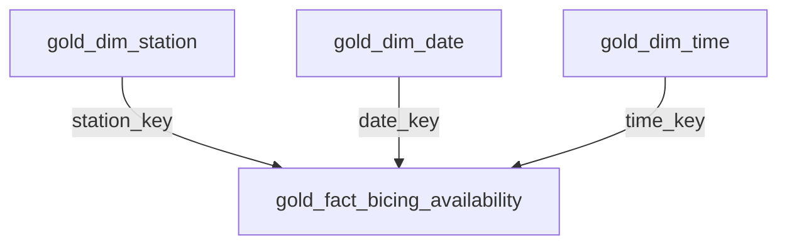

# Architecture

I use a Medallion architecture in Microsoft Fabric.



## Bronze

Context source:

```text
Files/bronze/opendata/district_data/district_data.json
```

Bicing history:

```text
Files/bronze/citybikes/bicing/history/year=YYYY/month=MM/day=DD/bicing_YYYYMMDD_HHMMSS.json
```

Timestamped snapshots prevent overwrite and preserve historical observations for replay and incremental processing.

## Silver

Operational tables:

- `silver_district_context`
- `silver_bicing_station_status` — initial single-snapshot milestone
- `silver_bicing_station_history` — historical incremental table

Historical grain:

```text
station_id + snapshot_ingested_at
```

The historical table is updated with a watermark-based incremental process and an idempotent Delta MERGE.

## Current orchestration

```text
cp_ingest_bicing_bronze
        │ Success
        ▼
nb_process_bicing_history
```

The notebook reads only snapshots newer than the current Silver watermark.

The Gold notebook is currently a downstream analytical build executed separately. It is not yet attached to the ingestion pipeline, so the repository does not claim Gold orchestration that has not been implemented.

## Gold

Gold is now implemented as a star schema.



### Fact grain

```text
one Bicing station observation per ingestion snapshot
```

Logical historical key:

```text
station_key + snapshot_ingested_at
```

### Dimension responsibilities

- `gold_dim_station` describes the latest known station attributes.
- `gold_dim_date` provides reusable calendar attributes.
- `gold_dim_time` provides observed time-of-day attributes and day periods.
- `gold_fact_bicing_availability` stores measurable station availability observations and derived KPIs.

Gold uses a deterministic `xxhash64(station_id)` surrogate key for station relationships.

## Rebuild strategy

Silver is the historical source of truth and is incrementally maintained.

Gold is currently rebuilt from the complete validated Silver history:

```text
Silver history
      │
      ▼
build dimensions + fact
      │
      ▼
quality checks
      │
      ▼
Delta overwrite
```

This keeps the analytical model consistent while the dataset is still small and the model is evolving. Gold can be made incremental later if data volume justifies the additional complexity.

## Context dataset boundary

`silver_district_context` is not currently joined into the Bicing star schema because the two datasets do not expose a reliable direct join key or equivalent spatial geometry in the current model.

No name-based or artificial join is used. A future spatial enrichment can assign stations to districts or neighborhoods when appropriate geographic boundaries are available.
