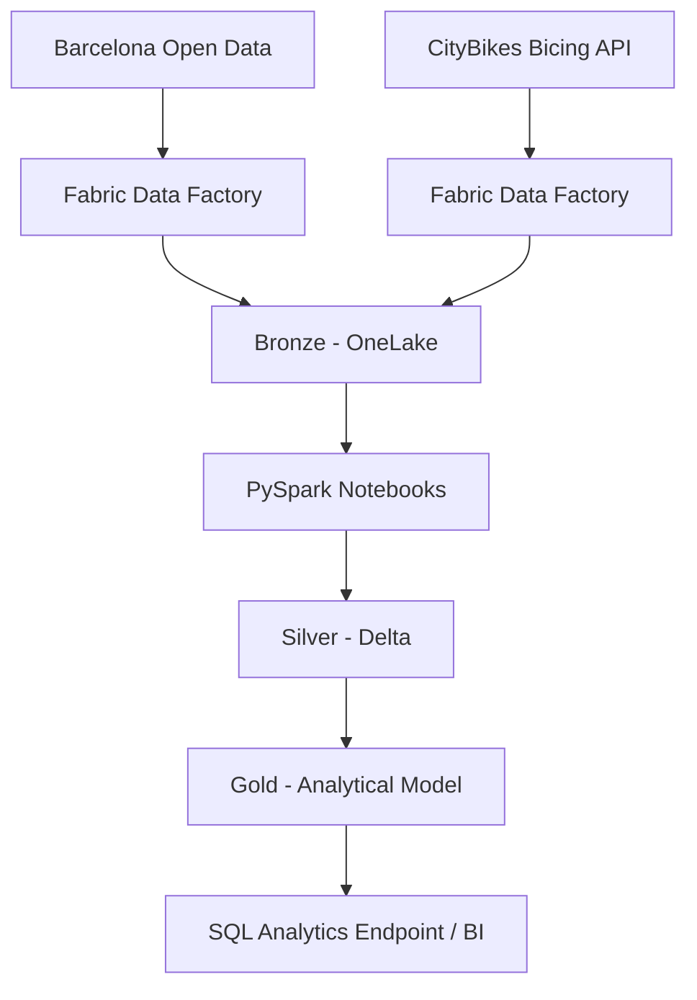

# Architecture

I use a Medallion architecture in Microsoft Fabric.



## Bronze

Context source:

```text
Files/bronze/opendata/district_data/district_data.json
```

Bicing history:

```text
Files/bronze/citybikes/bicing/history/year=YYYY/month=MM/day=DD/bicing_YYYYMMDD_HHMMSS.json
```

Timestamped snapshots prevent overwrite and preserve historical observations.

## Silver

Operational tables:
- `silver_district_context`
- `silver_bicing_station_status` — initial single-snapshot milestone
- `silver_bicing_station_history` — historical incremental table

Historical grain: `station_id + snapshot_ingested_at`.

## Orchestration

```text
cp_ingest_bicing_bronze
        │ Success
        ▼
nb_process_bicing_history
```

The notebook reads only snapshots newer than the current watermark and performs an idempotent Delta MERGE.

## Gold

Gold is the next milestone and will expose business-ready mobility facts, dimensions and KPIs.
