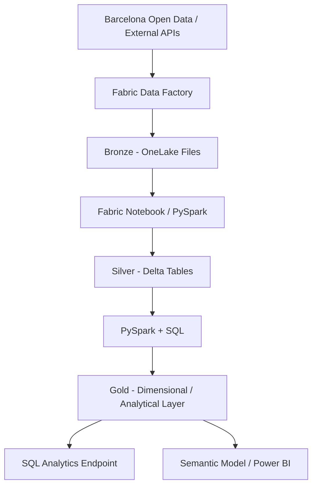

# Architecture

I am using a Medallion architecture in Microsoft Fabric so raw ingestion, standardized data and analytical data remain separated.



## Bronze

I preserve source responses with minimal modification so the original payload remains available for replay, auditing and troubleshooting.

Current path:

```text
Files/bronze/opendata/district_data/district_data.json
```

## Silver

I will normalize nested API responses, enforce data types, remove duplicates, validate nulls and persist curated Delta tables.

## Gold

I will model business-ready mobility entities, dimensions, facts and KPIs for SQL and analytical consumption.

## Current Fabric components

| Component | Name | Status |
|---|---|---|
| Workspace | Barcelona Urban Mobility | Implemented |
| Lakehouse | barcelona_mobility_lakehouse | Implemented |
| Pipeline | pl_ingest_mobility_bronze | Implemented |
| Copy activity | cp_ingest_mobility_bronze | Implemented |
| Bronze raw JSON | district_data.json | Implemented |
| Silver notebook | Pending | Next |
| Gold model | Pending | Planned |

## Architecture image


