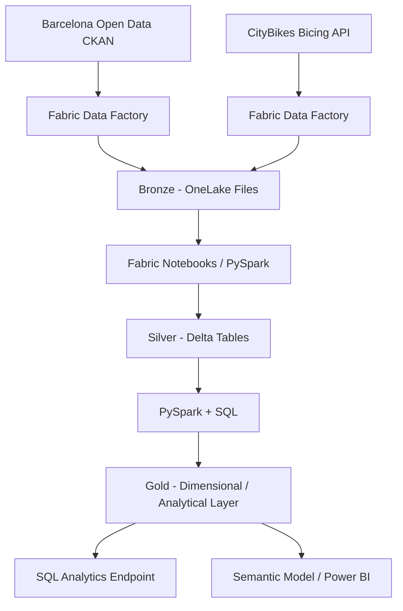

# Architecture

I use a Medallion architecture in Microsoft Fabric to separate source preservation, data standardization and analytical serving.



## Bronze

I preserve API responses with minimal modification so original payloads remain available for replay, auditing and troubleshooting.

Current Bronze objects:

```text
Files/bronze/opendata/district_data/district_data.json
Files/bronze/citybikes/bicing/bicing_snapshot.json
```

The district source validates the contextual ingestion pattern. The Bicing source introduces operational mobility observations at station level.

## Silver

The first Silver transformation is implemented in `nb_bronze_to_silver_districts`.

It extracts `result.records`, flattens the nested CKAN response, standardizes names and types, executes quality checks and writes:

```text
silver_district_context
```

The next transformation will read `network.stations` from the Bicing Bronze snapshot and persist:

```text
silver_bicing_station_status
```

The target grain is one station observation per source snapshot.

## Gold

I will define the Gold model after the Bicing Silver dataset is operational and the analytical grain is validated. Gold will expose business-ready mobility entities, dimensions, facts and KPIs for SQL and BI consumption.

## Current Fabric components

| Component | Name | Status |
|---|---|---|
| Workspace | Barcelona Urban Mobility | Implemented |
| Lakehouse | barcelona_mobility_lakehouse | Implemented |
| Context pipeline | pl_ingest_mobility_bronze | Implemented |
| Context copy activity | cp_ingest_mobility_bronze | Implemented |
| Context Bronze JSON | district_data.json | Implemented |
| Context Silver notebook | nb_bronze_to_silver_districts | Implemented |
| Context Silver Delta table | silver_district_context | Implemented |
| Context Silver assertions | Notebook assertions | Implemented |
| Bicing pipeline | pl_ingest_bicing_bronze | Implemented |
| Bicing copy activity | cp_ingest_bicing_bronze | Implemented |
| Bicing Bronze JSON | bicing_snapshot.json | Implemented |
| Bicing Silver notebook | nb_bronze_to_silver_bicing | Next |
| Bicing Silver Delta table | silver_bicing_station_status | Planned |
| Gold model | Pending | Planned |

## Architecture image

A polished end-to-end architecture diagram will be added as `assets/images/architecture-overview.png` when the target architecture is complete.
