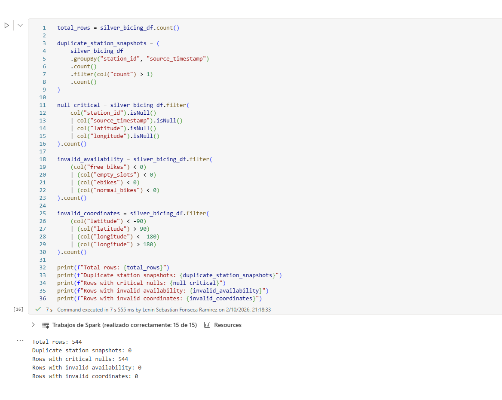
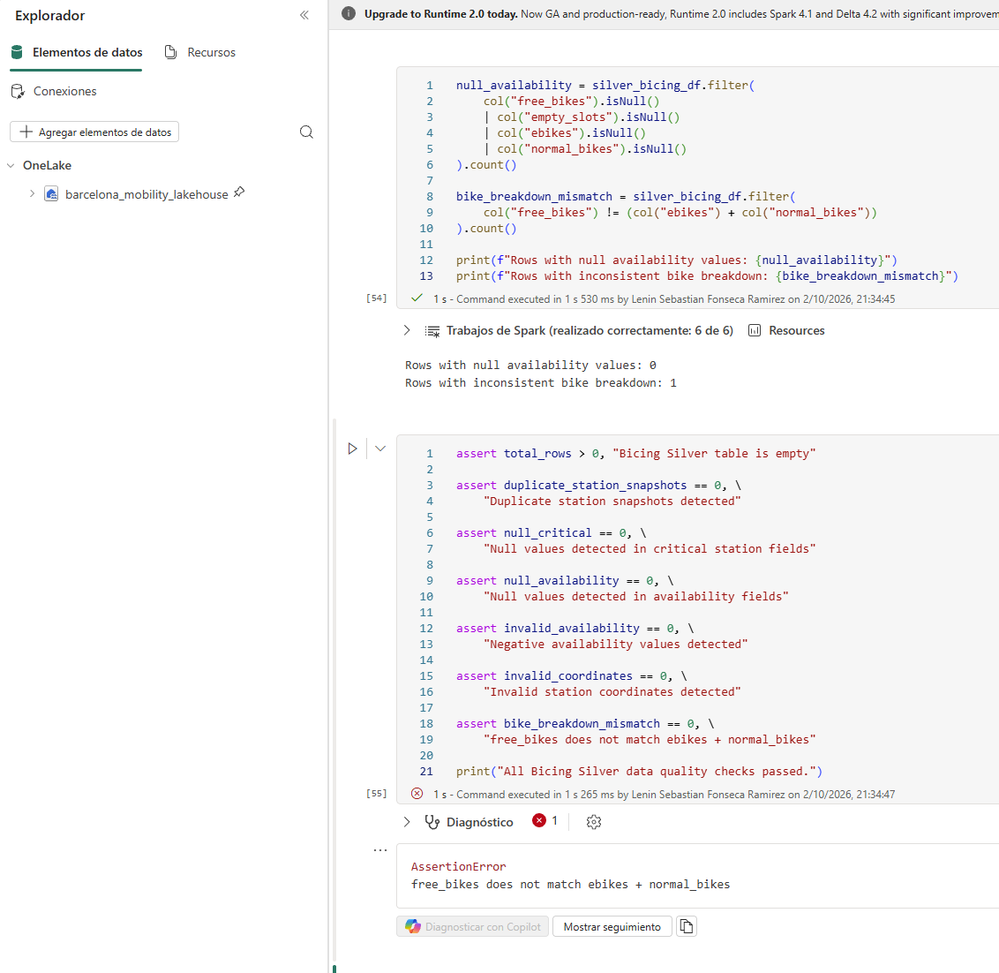

# Troubleshooting

This document records implementation issues that required investigation and resulted in a meaningful engineering decision or data-quality improvement.

Routine configuration mistakes and transient UI issues are not included.

---

## 1. CityBikes timestamp parsing failure

### Problem

The initial Bicing Silver transformation used:

```python
to_timestamp(col("timestamp")).alias("source_timestamp")
```

The transformation completed, but the data-quality checks detected:

```text
Total rows: 544
Rows with critical nulls: 544
```

A column-level null check confirmed that `source_timestamp` was null for every station record.

### Investigation

The source timestamp was returned in a format similar to:

```text
2026-10-02T18:44:25.452459+00:00Z
```

The value contained both an explicit UTC offset (`+00:00`) and a trailing `Z`. Spark's default `to_timestamp()` parsing did not convert this representation successfully.

### Fix

I normalized the source string by removing only the trailing `Z` and then applied an explicit timestamp pattern:

```python
to_timestamp(
    regexp_replace(col("timestamp"), "Z$", ""),
    "yyyy-MM-dd'T'HH:mm:ss.SSSSSSXXX"
).alias("source_timestamp")
```

The explicit pattern preserves the microsecond precision and UTC offset.

### Validation

After rebuilding `silver_bicing_df`, the critical null check returned:

```text
Rows with critical nulls: 0
```

The timestamp remained a critical field, so future parsing failures continue to stop the Silver validation process.

### Evidence



---

## 2. Bike availability breakdown inconsistency

### Problem

The initial quality model treated the following relationship as a mandatory invariant:

```text
free_bikes = ebikes + normal_bikes
```

The quality check detected one inconsistent station record and the assertion stopped execution:

```text
Rows with inconsistent bike breakdown: 1
AssertionError: free_bikes does not match ebikes + normal_bikes
```

### Investigation

The affected source record reported:

```text
station_uid: 269
station_name: VIA BARCINO, 105/107
free_bikes: 0
ebikes: 1
normal_bikes: 4
empty_slots: 13
is_online: false
```

The station was offline at the time of the source snapshot. I treated this as an observed condition, not as proof that the offline state caused the inconsistency.

The source values were preserved exactly as received.

### Engineering decision

The relationship between `free_bikes` and the bike-type breakdown could not be treated as a guaranteed source invariant.

I therefore changed the rule from a critical assertion to a non-critical quality warning and added:

```python
.withColumn(
    "bike_breakdown_valid",
    col("free_bikes") ==
    (col("ebikes") + col("normal_bikes"))
)
```

Critical checks still stop the transformation for conditions such as:

- missing station identifiers or timestamps
- invalid coordinates
- negative availability values
- duplicate station snapshots

The bike-breakdown mismatch remains visible and queryable without modifying or discarding the source record.

### Validation

The final validation produced:

```text
WARNING: 1 station records have an inconsistent bike breakdown.
All critical Bicing Silver data quality checks passed.
```

### Evidence



---

## Result

These cases established a two-level data-quality strategy:

```text
Critical rule violation
        ↓
Stop the transformation

Non-critical source inconsistency
        ↓
Preserve the record
        ↓
Expose a quality flag / warning
```

This approach prevents invalid curated data from being persisted while retaining traceability for source anomalies that remain analytically useful.
