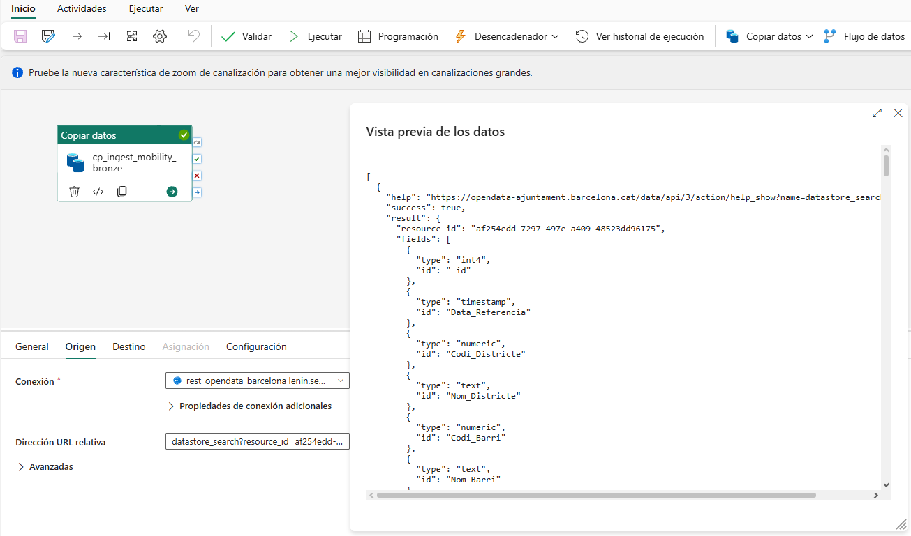
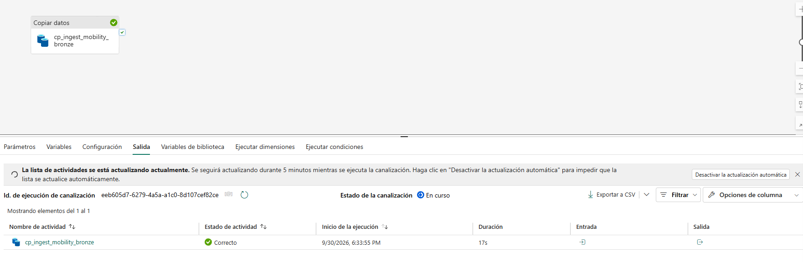
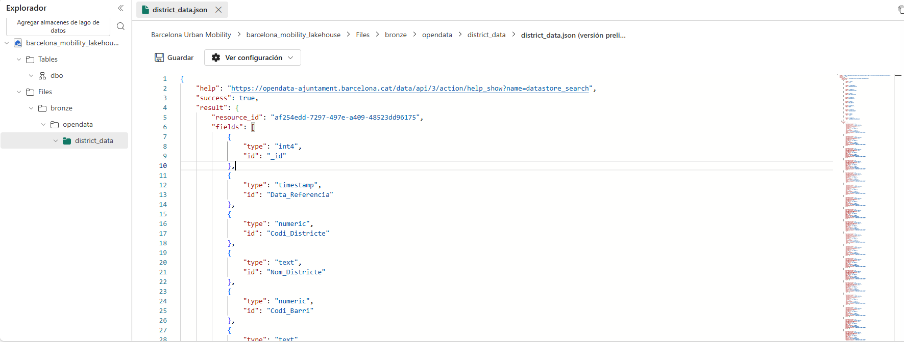

# Fabric Pipelines

## pl_ingest_mobility_bronze

I use this Fabric Data Factory pipeline to ingest the contextual Barcelona Open Data source.

### Activity

```text
cp_ingest_mobility_bronze
```

### Source configuration

| Setting | Value |
|---|---|
| Connector | REST |
| Base URL | `https://opendata-ajuntament.barcelona.cat/data/api/action/` |
| Relative URL | `datastore_search?resource_id=af254edd-7297-497e-a409-48523dd96175&limit=100` |
| Method | GET |
| Authentication | Anonymous |
| Privacy level | Public |

The response is a CKAN JSON envelope containing metadata, field definitions and `result.records`.

### Destination configuration

| Setting | Value |
|---|---|
| Destination | Fabric Lakehouse |
| Lakehouse | `barcelona_mobility_lakehouse` |
| Root | Files |
| Folder | `bronze/opendata/district_data` |
| File | `district_data.json` |
| Format | JSON |

### Validation

I validated the source preview, successful pipeline execution and raw JSON persistence in OneLake.

---

## pl_ingest_bicing_bronze

I use this pipeline to ingest operational Bicing station availability through the CityBikes REST API.

### Activity

```text
cp_ingest_bicing_bronze
```

### Source configuration

| Setting | Value |
|---|---|
| Connector | REST |
| Connection | `rest_citybikes_bicing` |
| Base URL | `https://api.citybik.es/v2/` |
| Relative URL | `networks/bicing` |
| Method | GET |
| Authentication | Anonymous |

The response contains network metadata and a `network.stations` array. Each station record includes operational fields such as station ID, name, latitude, longitude, source timestamp, free bikes and empty slots.

### Destination configuration

| Setting | Value |
|---|---|
| Destination | Fabric Lakehouse |
| Lakehouse | `barcelona_mobility_lakehouse` |
| Root | Files |
| Folder | `bronze/citybikes/bicing` |
| File | `bicing_snapshot.json` |
| Format | JSON |

### Validation

I validated the REST source response, executed the pipeline successfully and confirmed that the destination file can be read from the configured Bronze path.

### Current design limitation

The current filename represents a single snapshot and is intentionally simple for the initial ingestion milestone. The next iteration will preserve multiple observations over time instead of relying on a single overwritten snapshot.

## Initial source fallback

I originally tested Bicing's public GBFS endpoint directly through Fabric. The upstream endpoint returned a temporary HTTP 503 block, so I used the Barcelona Open Data CKAN API to validate the first ingestion path and later introduced CityBikes as the operational Bicing source.

## Evidence






